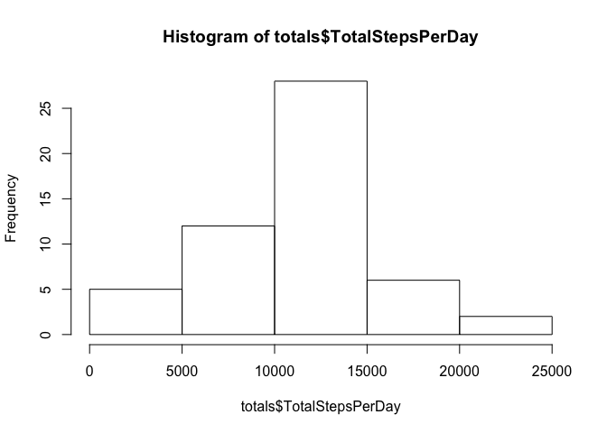
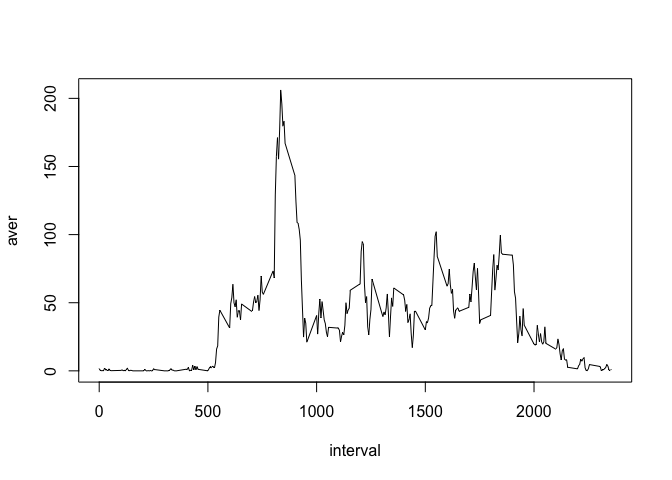
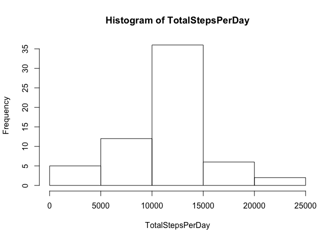
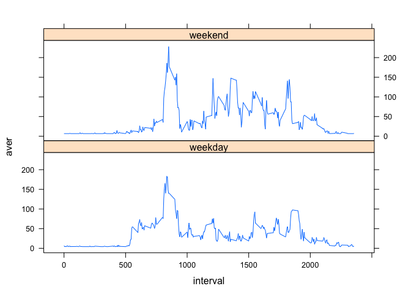

## Loading and preprocessing the data


```r
dfAll<-read.csv('activity.csv')
df<-filter(dfAll,!is.na(steps))
```


## What is mean total number of steps taken per day?
I will ignore the missing values in the dataset.  

Calculate the total number of steps taken per day by grouping them by date and summing.   

Calculate and report the mean and median of the total number of steps taken per day


```r
totals<- group_by(df,date) %>% summarise(TotalStepsPerDay=sum(steps))
with(totals, hist(totals$TotalStepsPerDay))
```

<!-- -->

```r
summary(totals$TotalStepsPerDay)[3:4]
```

```
##   Median     Mean 
## 10765.00 10766.19
```


## What is the average daily activity pattern?

This code will make a time series plot (i.e. type = "l") of the 5-minute interval (x-axis) and the average number of steps taken, averaged across all days (y-axis).


```r
avePer5min<-group_by(df,interval) %>% summarise(aver=mean(steps))
with(avePer5min, plot(interval, aver, type='l'))
```

<!-- -->

The following code tells us the 5-minute interval, on average across all the days in the dataset, which contains the maximum number of steps (the busiest part of the day). 

```r
time<-as.numeric(as.character(avePer5min[which.max(avePer5min$aver),1][[1]]))/60
hr<-hour(hm(time))
minutes<-(time-hr)*60
```

It tell us that busiest period is at 13 hours and 55 minutes. 

## Imputing missing values

Note that there are a number of days/intervals where there are missing values (coded as NA).  
The presence of missing days may introduce bias into some calculations or summaries of the data.

First I will calculate and report the total number of missing values in the dataset (i.e. the total number of rows with NAs).


```r
sum(is.na(dfAll$steps))
```

```
## [1] 2304
```

My strategy for filling in all of the missing values in the dataset is not sophisticated. I take the daily mean for each interval and then the mean of all those through the day.  Then I create a new dataset that is equal to the original dataset but with the missing data filled in.


```r
dfAll[is.na(dfAll$steps),1]<- mean(avePer5min$aver)
head(dfAll)
```

```
##     steps       date interval
## 1 37.3826 2012-10-01        0
## 2 37.3826 2012-10-01        5
## 3 37.3826 2012-10-01       10
## 4 37.3826 2012-10-01       15
## 5 37.3826 2012-10-01       20
## 6 37.3826 2012-10-01       25
```


Make a histogram of the total number of steps taken each day and Calculate and report the mean and median total number of steps taken per day. 


```r
totalsImp<- group_by(dfAll,date) %>% summarise(TotalStepsPerDay=sum(steps))
with(totalsImp, hist(TotalStepsPerDay))
```

<!-- -->

```r
summary(totalsImp$TotalStepsPerDay)[3:4]
```

```
##   Median     Mean 
## 10766.19 10766.19
```
These values differ only very slightly from the estimates from the first part of the assignment? The impact of imputing missing data on the estimates of the total daily number of steps is to make the mean = the median.


## Are there differences in activity patterns between weekdays and weekends?

For this part I will use the weekdays() function and the dataset with the filled-in missing values.  

First I create a new factor variable in the dataset with two levels – “weekday” and “weekend” indicating whether a given date is a weekday or weekend day.


```r
dfAll<-mutate(dfAll, wkday=wday(dfAll$date))
dfAll<-mutate(dfAll, wdOrwe=wkday)
dfAll[dfAll$wdOrwe %in% c(1:5),5]<-"weekday"
dfAll[dfAll$wdOrwe %in% c(6:7),5]<-"weekend"
dfAll$wdOrwe<-factor(dfAll$wdOrwe)
```


Make a panel plot containing a time series plot (i.e. type="l") 
of the 5-minute interval (x-axis) and the average number of steps taken, averaged across all weekday days or weekend days (y-axis). 


```r
wdsavePer5min<-filter(dfAll, wdOrwe=="weekday") %>% group_by(interval) %>% summarise(aver=mean(steps))
wdsavePer5min[,"wdOrwe"]<-"weekday"
wesavePer5min<-filter(dfAll, wdOrwe=="weekend") %>% group_by(interval) %>% summarise(aver=mean(steps))
wesavePer5min[,"wdOrwe"]<-"weekend"

bothavePer5min<-rbind(wdsavePer5min,wesavePer5min) %>% transform(wdOrwe=factor(wdOrwe))

with(bothavePer5min, xyplot(aver ~ interval | wdOrwe, type="l", layout=c(1,2)))
```

<!-- -->

The most obvious difference in activity is that **at the weekend the activity is more spread out through the day** wheras during the weekdays the afternoon is quite sedentary.
